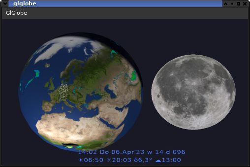

A nice desktop clock in earth shape.

Additional formats:
%D earth declination (for northern hemisphere) 
%rise sun rise for the location setup by latitude / longitude 
%set sun set 
\n new line 
%weather for the used weather time 

configure:
     allow --with-gles using GL ES 3 e.g. useful on Raspi's (requires same use on GenericGlm)

Added option to display Geo.json files (presume EPSG:4326 coordinates (based on WGS 84 at the used scale the differences should not matter)).
As there are many files with a high density of points around there are some limits implemented, just in case your might wonder.
The function uses the shortest path between the given points,
but as we live on a sphere (almost) that might hide some part of the lines (these cases should be rare,
and i didn't try to bend the lines as i live in some aged country with "wrinkles" all over).

Build with autotools, requires genericGlm and geodata
(see there for some basic build infos).
The files are not very portable, if you don't use gnu tools there might be issues.

In directory res there are some images required i didn't add here for the possible licence issues.
They are download when build with curl, so if you are sensitve to licence issue, or want to use a different download-tool see res/Makefile.am.

Build for windows was integrated at least for msys2 
<pre>
  look for "$host_os" = "mingw32"
</pre>

## Configuration

The most obvious option use the dialog.
For some advanced options use the config file e.g. ~/.config/glglobe.conf
e.g. if you want to use some diffrent WebMapService (i can't gurantee this will work, but it might be worth trying).
These services are numberd from 0...9 the following values will be required suffixed with a sequential number:

<ul>
  <li>
    <pre>weatherAddress</pre> the base address for WMS requests to test add "?service=WMS&version=1.3.0&request=GetCapabilities" and you should get a XML document with the avaialble services.
  </li>
  <li>
    <pre>weatherName</pre> a unique name that helps to idenifiy the service
  </li>
  <li>
    <pre>weatherDelay</pre> services usually helpful to use the nearest time for a request, but picky if you get to close to the actual time (this can be estimated from the difference of latest value of dimension time to actual time, for a service with a short period)
  </li>
  <li>
    <pre>weatherType</pre> WMS for WebMapService, RE for RealEarth (which is non-generic)
  </li>
  <li>
    <pre>weatherLocalTime</pre> usually false (true if service offers prognosis but you want to view current time)
  </li>
</ul>

This is target on some near time images provided with regular intervals.
This is not a GIS (Geo info system) so it will not work with services
that offer fragmented timelines / historic images
for example (https://neo.gsfc.nasa.gov/about/wms.php
( QGis might help you better with these)).

## Troubleshooting

First some messages are output to the console if something seems not quite right.
For advanced issues there are some defines e.g. CONFIG_DEBUG that might help in identifying more specific issues.
